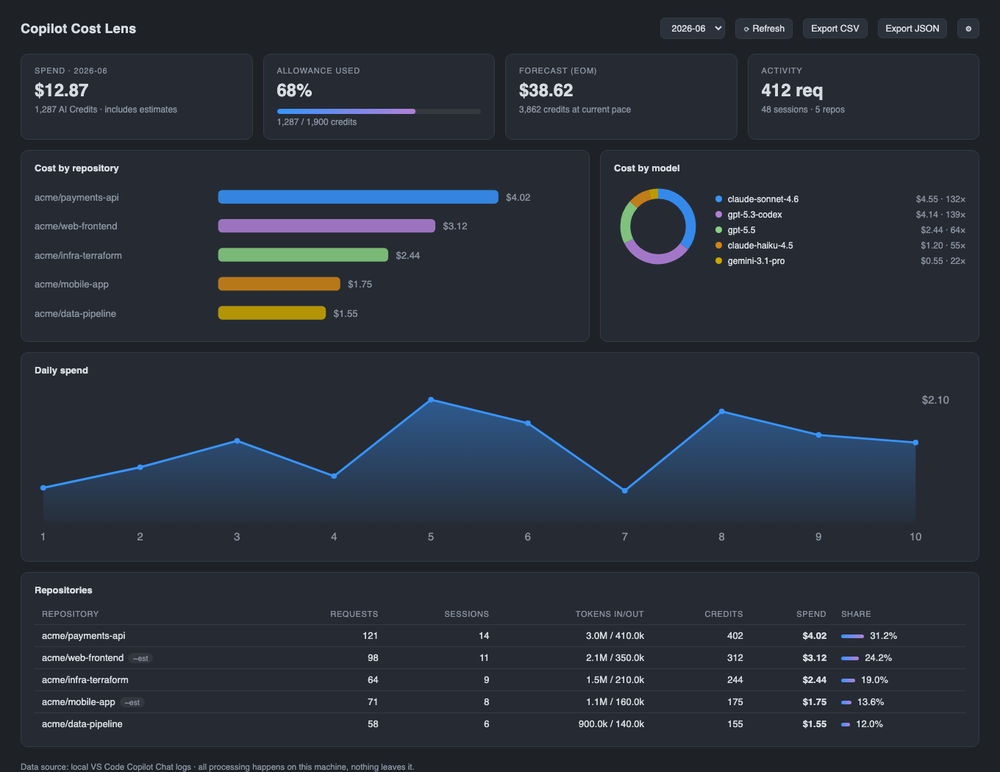
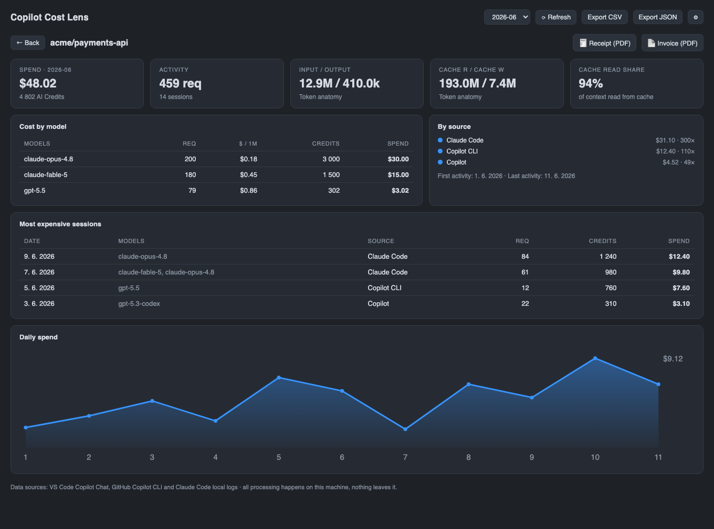
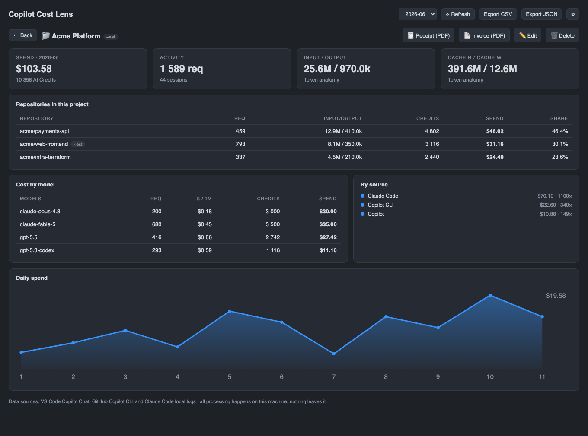
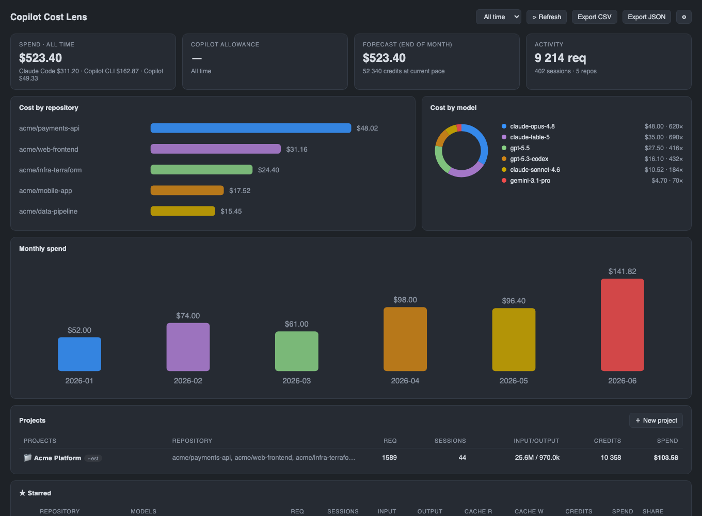
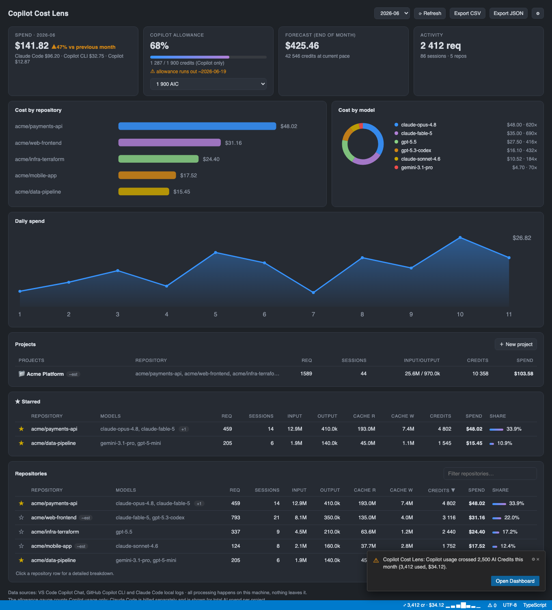
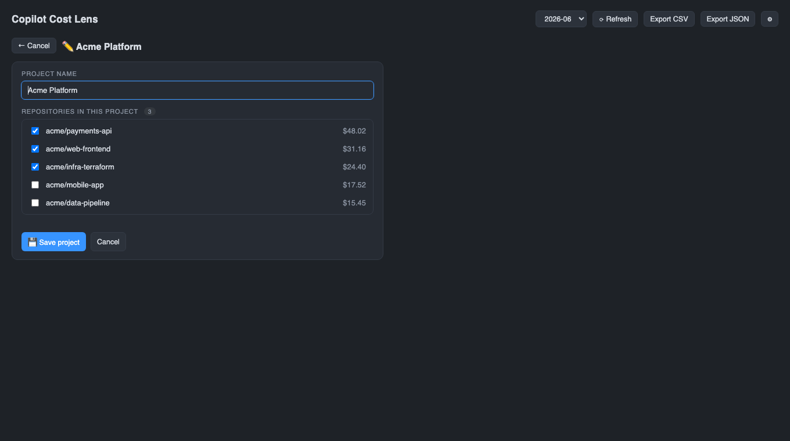
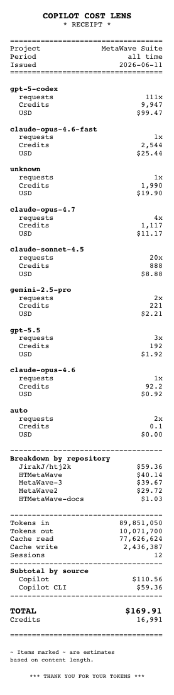
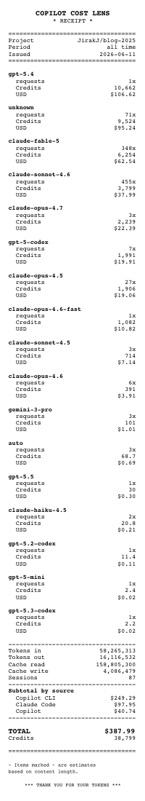

# Cost Lens for GitHub Copilot

[](https://marketplace.visualstudio.com/items?itemName=JakubJirak.copilot-cost-lens)
[](https://marketplace.visualstudio.com/items?itemName=JakubJirak.copilot-cost-lens)
[](https://github.com/JirakJ/copilot-cost-lens/actions/workflows/ci.yml)
[](LICENSE)

**Know exactly what your AI coding tools cost you — per repository, per model, per day. 100% local and private.**

Cost Lens reads the logs that GitHub Copilot (VS Code Chat **and** the Copilot CLI) and optionally Claude Code already keep on your machine, attributes every request to the repository you were working in, prices it using the providers' model rates, and turns the result into a live dashboard and a status-bar ticker.



| Repository detail | Project (group) detail |
|---|---|
|  |  |

| All-time view | Alerts & status bar |
|---|---|
|  |  |



<details>
<summary>Project receipt — combined, with per-repository breakdown</summary>


</details>

<details>
<summary>Single-repository receipt — the thermal-printer look</summary>


</details>

## Why

Since GitHub Copilot moved to usage-based billing (AI Credits), the question is no longer *"how many requests did I make?"* but *"which project is burning my credits, on which model, and will I fit into my monthly allowance?"* GitHub's billing page gives you an account-level total — Cost Lens gives you the per-repository breakdown it can't.

## Features

- **Cost per repository** — every chat request is attributed to the workspace it ran in, resolved to a `owner/repo` slug via the project's git remote when available.
- **All your AI tools in one ledger** — VS Code Copilot Chat, GitHub Copilot CLI agent sessions and Claude Code transcripts, with a per-provider spend split. Claude Code never counts against your Copilot allowance — it's shown so you see the *total* AI cost of a project.
- **Token anatomy** — input, output, cache read and cache write tokens per repository, plus the exact models used and how often.
- **Project drill-down** — click any repository for a detailed view: model mix, daily trend, source split, token anatomy, first/last activity.
- **All-time view** — switch the period selector to *All time* to see everything since your logs began, not just one month.
- **PDF receipts** — export a classic printed-receipt PDF per repository or per project (with a per-repository breakdown), including model line items, token counts, effective $/1M rates and totals. Great for chargeback or framing on the wall.
- **Project groups** — roll several repositories (frontend, backend, e2e…) into one named project, straight from the dashboard ("＋ New project" → pick repos; membership is exclusive). The aggregated project gets its own detail and a combined receipt with per-repository breakdown.
- **Starred repositories** — pin your important repos with a ☆ and they surface in a dedicated section at the top of the dashboard.
- **Rename repositories** — give hash-named remote repositories like `(unknown) 2bebdc79` a friendly display name; the alias follows the repository through every view, project total and receipt. Hover a table row for the ✎ button, or use the detail view.
- **Hide repositories** — remove noise repos with the 🙈 button (row hover or detail view). Raw CSV/JSON exports and budget alerts still see the full picture; unhide via `Copilot Cost Lens: Manage Hidden Repositories`.
- **Your currency** — show all amounts in EUR, CZK, GBP… via `copilotCostLens.displayCurrency` plus a manually set exchange rate. No network calls, ever; receipts stay in USD.
- **Runaway-session alert** — set `copilotCostLens.sessionCostAlertUsd` and get warned the moment a single (agent) session crosses your dollar threshold — before it becomes a surprise on the bill.
- **Credit alerts** — set absolute thresholds (e.g. 2,500 AIC) and get notified once per month when month-to-date Copilot usage crosses them, on top of the percentage warning.
- **Localized** — English, Čeština, Deutsch and 日本語, following your VS Code display language.
- **Dashboard** — monthly overview with spend, allowance gauge, end-of-month forecast, cost-by-repo chart, model donut, daily spend trend and a sortable repository table. Adapts to your color theme.
- **Status bar** — month-to-date credits and dollars at a glance; turns orange when you cross your warning threshold.
- **Budgets & alerts** — pick your monthly allowance right in the dashboard (1,900 / 3,900 / 10k / 100k / 1M AIC or a custom number) and an optional dollar budget; get warned once a day when you cross the threshold.
- **Forecast & burn rate** — linear end-of-month projection, month-over-month trend, and a projected date your allowance runs out at the current pace.
- **Cost detective tools** — the most expensive sessions per repository, cache read share (how much of your context comes from cache), and a per-month bar chart in the all-time view.
- **Status-bar sparkline** — the last 7 days of spend at a glance, right next to the month-to-date total.
- **Built for 100+ repositories** — instant text filter, source chips (Copilot / CLI / Claude Code) and sortable columns in the repository table, starred repos pinned on top, and "Open in VS Code" straight from a repository detail.
- **Activity heatmap** — a calendar of daily spend over the last 26 weeks reveals your usage rhythm at a glance.
- **Export** — one click to CSV or JSON for invoicing, chargeback or further analysis.
- **Multi-installation** — scans VS Code, VS Code Insiders, VSCodium, Cursor and Windsurf storage automatically; extra locations are configurable.
- **Zero runtime dependencies** — small, fast, auditable.

## How it works

Cost Lens combines these local sources:

| Source | What it provides | Accuracy |
|---|---|---|
| VS Code: `GitHub.copilot-chat/transcripts/*.jsonl`, `debug-logs/**.jsonl` | exact token counts and billed AI-credit units per request | **exact** |
| VS Code: `chatSessions/*.json` | model, timestamp and conversation content | **estimated** from content length |
| Copilot CLI: `~/.copilot/session-state/**` | exact per-model tokens incl. cache read/write, billed premium requests / AI-credit units, repository slug | **exact** (estimation fallback for crashed sessions) |
| Claude Code: `~/.claude/projects/**/*.jsonl` | exact per-request tokens incl. cache read/write, model, working directory | **exact** |
| JetBrains Copilot: `~/.config/github-copilot/<ide>/**` (opt-in) | repository + models recovered; cost estimated from content (plugin stores no token counts) | **estimated** |

When both exact and estimated data exist for the same session, exact wins. Estimated entries are always marked (`~est`) in every view. Costs are computed as:

1. **Billed units** from the logs when present — AI-credit nano units (`1 credit = $0.01`) or premium requests (`$0.04` each, pre-June-2026 Copilot billing),
2. otherwise **exact tokens × model rate** (built-in price table, USD per 1M tokens),
3. otherwise **estimated tokens × model rate**.

The built-in price table covers GPT, Claude, Gemini, Grok and more, and every rate can be overridden in settings — so when GitHub updates pricing, you don't have to wait for an extension update.

> **Disclaimer:** Cost Lens is an independent open-source project, not affiliated with GitHub or Microsoft. The log format is not a stable public API and numbers shown here are an analytical aid, not a bill. Your GitHub billing page remains the source of truth.

## Privacy

Everything happens on your machine. Cost Lens:

- reads only local files (VS Code `workspaceStorage`, and the Copilot CLI / Claude Code / JetBrains Copilot stores in your home directory),
- makes **no network requests**, collects **no telemetry**,
- never executes git — repository names are read from `workspace.json` and `.git/config` as plain files.

## Getting started

1. Install **Cost Lens for GitHub Copilot** from the Marketplace — the built-in **walkthrough** (Help → Get Started → Copilot Cost Lens) guides you through the rest.
2. Set `copilotCostLens.plan` to your Copilot plan (defaults to Business).
3. Open the **Copilot Cost Lens** view in the activity bar, or run `Copilot Cost Lens: Open Dashboard`.

Data appears automatically as you use Copilot Chat. Historical sessions already on disk are picked up on first scan.

## Settings

| Setting | Default | Description |
|---|---|---|
| `copilotCostLens.plan` | `business` | Plan preset for the included-credits gauge (`business`, `businessPromo`, `enterprise`, `enterprisePromo`, `custom`). |
| `copilotCostLens.includedCreditsPerMonth` | `1900` | Monthly allowance when plan is `custom`. |
| `copilotCostLens.projectGroups` | `{}` | Named projects: `{ "MyProduct": ["acme/fe", "acme/be"] }`. |
| `copilotCostLens.creditAlerts` | `[]` | Absolute AIC thresholds, each notifies once per month. |
| `copilotCostLens.monthlyBudgetUsd` | `0` | Personal dollar budget (0 = off). |
| `copilotCostLens.warnAtPercent` | `80` | Warning threshold for allowance/budget. |
| `copilotCostLens.statusBar.enabled` | `true` | Status-bar spend ticker. |
| `copilotCostLens.extraStorageRoots` | `[]` | Additional `workspaceStorage` roots to scan. |
| `copilotCostLens.claudeCode.enabled` | `true` | Include Claude Code usage in per-repo costs. |
| `copilotCostLens.copilotCli.enabled` | `true` | Include GitHub Copilot CLI usage. |
| `copilotCostLens.jetbrainsCopilot.enabled` | `false` | Include JetBrains Copilot chat sessions (estimated). |
| `copilotCostLens.starredRepos` | `[]` | Repositories pinned to the top of the dashboard. |
| `copilotCostLens.repoAliases` | `{}` | Display names: `{ "(unknown) 2bebdc79": "Backend API" }` — set via ✎ Rename. |
| `copilotCostLens.hiddenRepos` | `[]` | Repositories hidden from all views — set via 🙈 Hide, unhide via the Manage Hidden Repositories command. |
| `copilotCostLens.sessionCostAlertUsd` | `0` | Warn when one session crosses this USD amount (0 = off). |
| `copilotCostLens.displayCurrency` | `USD` | Currency code shown in the dashboard and status bar. |
| `copilotCostLens.usdExchangeRate` | `1` | Units of the display currency per 1 USD (manual, offline). |
| `copilotCostLens.documentLanguage` | `en` | Language of exported PDF receipts (`en`, `auto`, `cs`, `de`). |
| `copilotCostLens.estimation.enabled` | `true` | Estimate sessions that have no exact token data. |
| `copilotCostLens.estimation.charsPerToken` | `4` | Ratio used by the estimator — only affects `~est` entries. ~4 chars/token is the rule of thumb for English text and code (CJK ≈ 1–2); estimates land within roughly ±20–30 % of real counts. |
| `copilotCostLens.priceOverrides` | `{}` | Per-model rate overrides (USD per 1M tokens). |
| `copilotCostLens.refreshIntervalSeconds` | `120` | Background rescan interval. |

## Commands

- `Copilot Cost Lens: Open Dashboard`
- `Copilot Cost Lens: Refresh Usage Data`
- `Copilot Cost Lens: Export Usage as CSV` / `as JSON`
- `Copilot Cost Lens: Export Project Receipt (PDF)`
- `Copilot Cost Lens: Manage Hidden Repositories`
- `Copilot Cost Lens: Open Settings`
- `Copilot Cost Lens: Show Diagnostics` — scanned roots, file counts, events per source

## FAQ

**I see no data / the dashboard is empty.**
Switch the period to *All time* (the empty state offers a one-click button), or run `Copilot Cost Lens: Show Diagnostics` to see which storage roots were scanned and how many events were found per source. Most often the current month simply has no usage yet.

**Numbers don't match my GitHub bill exactly.**
Expected. Sessions without exact token logs are estimated from content length, code completions are not in chat logs (they're included in paid plans anyway), and Copilot usage outside this machine (web, CLI, other devices) is invisible locally. Treat Cost Lens as a relative lens on *where* your usage goes.

**I see `~est` everywhere.**
Your Copilot Chat version isn't writing token-level transcripts yet. Estimates still give you a faithful *relative* picture across repos; exact data is used automatically the moment it appears.

**Does it work with older "premium requests" billing?**
Yes — Copilot CLI sessions log the billed premium requests directly and Cost Lens prices them at $0.04 each; everything else falls back to token-based pricing. The AI Credits model (effective June 2026) is the primary target.

**How do I unhide a hidden repository?**
Open settings and remove its entry from `copilotCostLens.hiddenRepos` (the 🙈 Hide button in a repository's detail adds it there). Hidden repositories are excluded from the dashboard, status bar and receipts, but raw CSV/JSON exports and budget alerts still include them, so your totals never silently lie.

**Why is Claude Code in a Copilot extension?**
Because the question you actually ask is "what does this repository cost me in AI tools?" Claude Code spend is tracked separately from the Copilot allowance gauge and can be disabled with one setting.

## Development

```bash
npm install
npm run build        # bundle with esbuild
npm test             # vitest unit tests
npm run typecheck
npm run lint
npm run vsix         # package .vsix
```

Press <kbd>F5</kbd> in VS Code to launch the Extension Development Host.

## License

[MIT](LICENSE)
